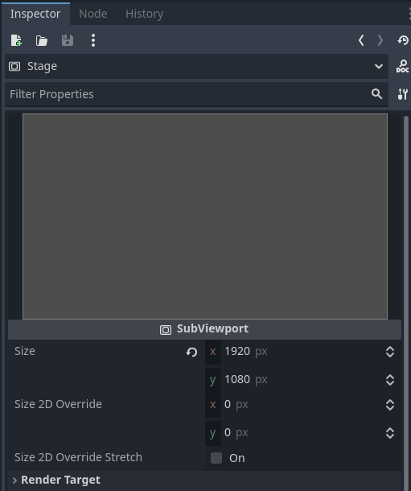
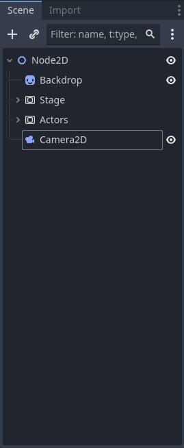

# Using Pre-rendered Backgrounds with Godot 4.4.x and Blender 4.5

This project presents a method of overlaying 3D Actors with a static pre-rendered background. Giving a similar effect to the early Resident Evil games. However, with this method we can go infront of and behind objects in a scene easily.

#### <p align="center">"That's the Second Biggest Monkey Head I've Ever Seen!"</p>
<table>
<tr>
  <td>

  </td>
  <td>
  
  </td>
	</tr>
</table>

> *The files available are for illustrative purposes only.*

<details>
	<summary><h2>Method</h2></summary>
	<details>
		<summary><h3><blockquote>Blender</blockquote></h3></summary>
		<details>
  			<summary><h4>Overview</h4></summary>

- Create scene
- Render scene and save to file
- Export scene, with camera, to .glb (glTF 2.0)  
		</details>
		<details>
  			<summary><h4>Procedure</h4></summary>
			<table>
			<tr >
				<td width="33%" align="center"></td>
				<td width="33%" align="center"></td>
				<td width="33%" align="center"></td>
			</tr>
			<tr>
				<td>Using Blender we create the set for our Scene and arrange a camera to view it with (see: *../Example/Files/Blender/Scene.blend*.)</td>
				<td>We render the scene and save it. A .PNG will be fine. This will be the Backdrop to our node in Godot.</td>
				<td>The Blender scene, including the Camera data, should also be exported as .glTF 2.0 file for use in Godot.</td>
			</tr>
			</table>
		</details>
	</details>
	<details>
		<summary><h3><blockquote>Godot</blockquote></h3></summary>
		<details>
			<summary><h4>Overview</h4></summary>

 - Import external files
 - Create scene with Node2D root node
 - Add Sprite2D node
 - Parent two SubViewports to the root
   - Set their size to match the screen
 - Add model to scene
   - Separate components (Make Local)
   - Attach Collision data (StaticBody3D) to Actors
   - Move the Mesh (MeshInstance3D) data to the Stage
 - Create Camera2D and parent to root
   - Set Anchor Mode to Fixed Top Left 
   - Add TextureRect as child
   - Set TextureRect to ViewportTexture
   - Point the ViewportTexture to the Actors Subviewport
 - Attach a MeshInstance3D to one of the 3D cameras
   - Make a new QuadMesh, set size to 2m
   - Make a new Shader Material
   - To Stage/Camera/Aperture create and code the Translate_Depth.gdshader
   - To Actors/Camera/Aperture create and code the Scene_Compositor.gdshader
 - Create and attach a script to the root node
 - Code, or add to the _on_ready() function with the Scene.gd script
 - Ensure Actors entities have their places
 - Set Stage and Actors to their own 3D Worlds
		</details>
		<details>
			<summary><h4>Pre-requisites</h4></summary>

You will need a 3D character with a script to handle movement. There is a simple Capsule supplied (see: *../Example/Files/Godot/Player Data/Player.tscn*) however you will need to bind your own keys to actions: move_forward,move_backward,move_left and move_right, for it to function with the Player script (see: *../Example/Files/Godot/Player Data/Player.gd*.)
		</details>
		<details>
			<summary><h4>Procedure</h4></summary>

##### Import

In Godot we can import our Blender files, Scene.png and Scene.glb. (And a 3D character, one is supplied if you don't have one readily available.) From here we should create a new scene and set the root as Node2D(*).

##### Set Backdrop Up

The first meta-layer we use will be the Backdrop. For this, create a new Sprite2D node attached to the root (or just drag 'n' drop the .png into the scene,) and set it to the backdrop image. Next, configure it so that the Offset/Centered is Off and set the Transform to (0,0) in world space.

<table>
	<tr>
		<td width="66%"></td>
		<td width="33%"></td>
	</tr>
</table>

##### SubViewport Setup

We have our painted backdrop in place. We now need to set the Stage for the actors. So, add two SubViewports to the root node. I have named them Stage and Actors respectively, and they'll be called this from here onwards. We need to resize both the Stage and Actors nodes to the size of our screen.

<table>
	<tr>
		<td width="66%"></td>
		<td width="33%"></td>
	</tr>
</table>

##### Arrange Blender Scene

Once we have the containers we need our model available to the scene.  The simplest way to achieve this is to drag and drop it into the root node, Node2D. For an easy collision model we can, on import, generate physics for our mesh. We then need to separate the components and reparent them by bringing up the right-click menu and selecting Make Local. 

<table>
	<tr>
		<td width="60%"></td>
		<td width="20%"></td>
		<td width="20%"></td>
	</tr>
</table>

With the individual parts available we reparent the Camera to the Stage, and make a copy that is parented to the Actors SubViewport.

The Meshes (named Suzanne and Cube in this example) are attached to the Stage. If you want to use the collision data from the model attach the StaticBody3D(s) to the Actors SubViewport. This is all the data we need from the model. However there is a loose Node3D (Scene) that can be safely removed from our project.

<table align="center">
	<tr>
		<td width="33%"></td>
		<td width="34%"></td>
		<td width="33%"></td>
	</tr>
</table>

##### Scene Camera

To complete our base hierarchy we add a Camera2D node to the root, and a TextureRect to that. Using the Inspector we attach a ViewportTexture and set that to the Actors Subviewport. Before we move on, select the Camera2D and set the Anchor Mode to Fixed Top Left in the properties pael.

<table align="center">
	<tr>
		<td width="33%"></td>
		<td width="67%"></td>
	</tr>
</table>

##### Own World 3D Cameras Setup

Now we need to look again at our 3D Cameras and to either add a MeshInstance3D and name it Aperture. We need to do this for both but we will begin with one, on the Stage. The properties of the MeshInstance3D should be a New QuadMesh that is doubled in size to fill the screen. To this new QuadMesh add a Material Override that is set to a New ShaderMaterial.

<table align="center">
	<tr>
		<td width="33%"></td>
		<td width="34%"></td>
		<td width="33%"></td>
	</tr>
</table>

##### Define Shaders

We will create two Shaders to linearlize the depth texture. However one will composite the textures into one image.

We begin with the Actors/Camera/Aperture.

<blockquote>
	<details>
		<summary><b>Translate_Depth.gdshader</b></summary>
		<table>
			<tbody>
 
```

shader_type spatial;
render_mode unshaded,ambient_light_disabled,depth_draw_always,shadows_disabled,cull_disabled;

uniform sampler2D DEPTH_TEXTURE : hint_depth_texture;

void vertex() {
	// Called for every vertex the material is visible on.
	POSITION = vec4( VERTEX.xy,1.,1. );
}

float get_linear_map( float t_depth,vec2 t_scr_uv,mat4 t_matrix ){
	
	#if CURRENT_RENDERER == RENDERER_COMPATIBILITY
	vec3 this_ndc = vec3(t_scr_uv, t_depth) * 2.0 - 1.0;
	#else
	vec3 ndc = vec3(SCREEN_UV * 2.0 - 1.0, t_depth);
	#endif
	vec4 view = t_matrix * vec4(this_ndc, 1.0);
	
	view.xyz /= view.w;
	
	float linear_depth = view.z*0.01;
	return linear_depth;
}

void fragment(){
	// Called for every pixel the material is visible on.
	float depth = texture( DEPTH_TEXTURE, SCREEN_UV).x;
	float linear_depth = get_linear_map( depth, SCREEN_UV, INV_PROJECTION_MATRIX );
	
	ALBEDO.rgb = vec3( fract( linear_depth ) );
}
```
</tbody>
</table>
</details>
</blockquote>
  
And, on to the Actors/Camera/Aperture we follow the same routine however we make a new shader: the Scene_Compositor.gdshader.
		<blockquote>
			<details>
				<summary><b>Scene_Compositor.gdshader</b></summary>
					<table>
						<tbody>
    
```
shader_type spatial;
render_mode unshaded,ambient_light_disabled,depth_draw_always,shadows_disabled,cull_disabled;

uniform sampler2D DEPTH_TEXTURE : hint_depth_texture;
uniform sampler2D GEOMETRY : filter_nearest;
uniform sampler2D BACKGROUND : filter_nearest;

void vertex() {
	// Called for every vertex the material is visible on.
	POSITION = vec4( VERTEX.xy,1.,1. );
}

float get_linear_map( float t_depth,vec2 t_scr_uv,mat4 t_matrix ){

	#if CURRENT_RENDERER == RENDERER_COMPATIBILITY
	vec3 this_ndc = vec3(t_scr_uv, t_depth) * 2.0 - 1.0;
	#else
	vec3 ndc = vec3(SCREEN_UV * 2.0 - 1.0, t_depth);
	#endif
	vec4 view = t_matrix * vec4(this_ndc, 1.0);

	view.xyz /= view.w;

	float linear_depth = view.z*0.01;
	return linear_depth;
}

void fragment(){
	// Set Background to our pre-rendered scene.
	ALBEDO.rgb = texture( BACKGROUND,SCREEN_UV ).rgb;

	// Get the texture created from our Geometry World3D.
	float geometry = texture( GEOMETRY,SCREEN_UV ).x;

	// Create a linearized depth map from our main 'Actors' scene.
	float depth = texture( DEPTH_TEXTURE,SCREEN_UV ).x;
	float linear_depth = get_linear_map( depth, SCREEN_UV, INV_PROJECTION_MATRIX );

	// Compare the depth maps and discard any pixels occuled by the former.
	if( fract(geometry) < fract(linear_depth) ){
		discard;
	}
}
```
</tbody>
</table>
</details>
</blockquote>

<table align="center">
	<tr>
		<td width="50%"></td>
		<td width="50%"></td>
	</tr>
</table>

You can see that there is not much difference between the two, but the second one composites where the other just translates Godots' depth texture.

##### Scene Script and Initialization

There is only one last script we need to make; on the root node attach a script. The function will, on Scene instantiation read the depth texture from the Stage and send that, and the Backdrop image, to the Compositor shader.
		<blockquote>
			<details>
				<summary><b>Scene.gd</b></summary>
				<table>
  					<tbody>    
```
extends Node2D

func _ready() -> void:
	$Actors/Camera/Aperture.material_override.set_shader_parameter("BACKGROUND",$Backdrop.texture)
	var stage_set = $Stage.get_texture()
	$Actors/Camera/Aperture.material_override.set_shader_parameter("GEOMETRY",stage_set)

```
</tbody>
</table>
</details>
</blockquote>

<table align="center">
	<tr>
		<td width="100%"></td>
	</tr>
</table>

##### Final Considerations

<table align="center">
	<tr>
		<td width="33%"></td>
		<td width="34%"></td>
	</tr>
</table>

With this done we can add our Player, props and other interactables to Actors to be properly occluded. (I also added a light that will interact with the Actors.) With consideration being made to their placement within the scene. As when they populate their Own World 3D they will not be visible in the editor viewport. Which leads us to the final step. On both the Stage and Actors properties set the Own World 3D option to on.

<td width="33%"></td>

Now we have a lightweight scene that loads a depth map on entry. Well done! Gl;hf.
		</details>
	</details>
</details>
